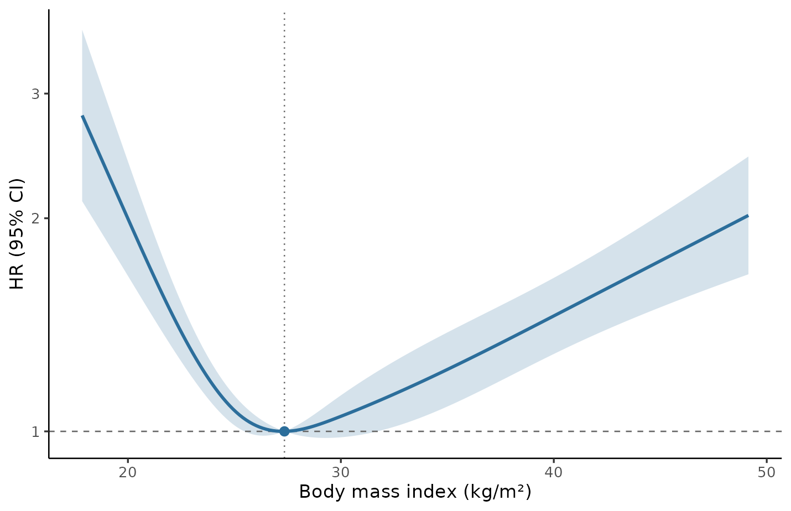
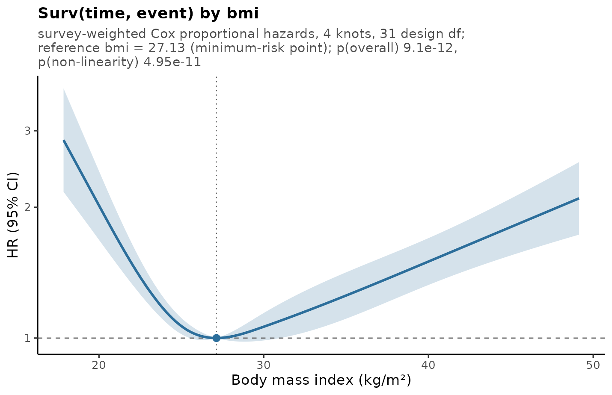
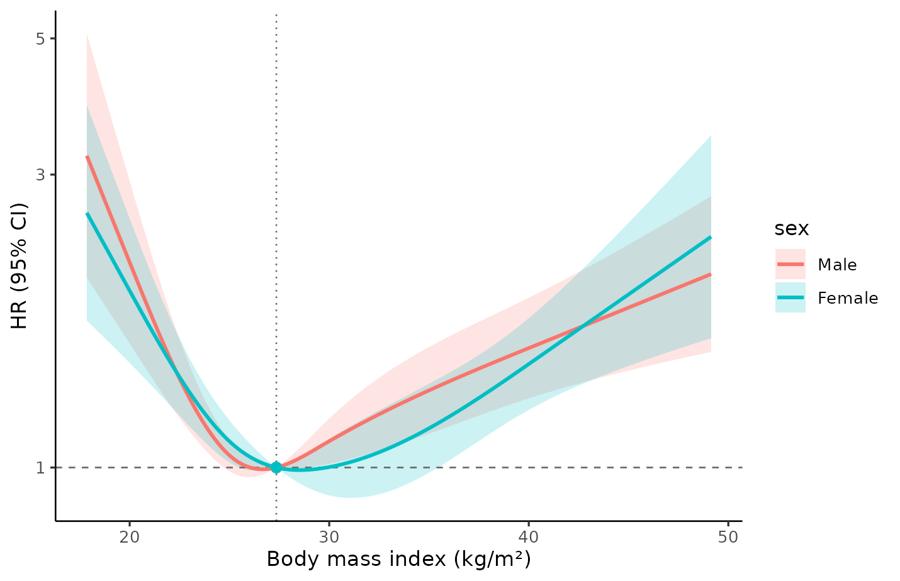
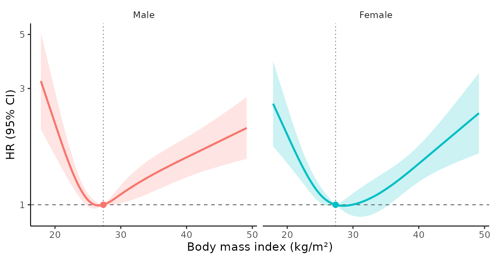

# Restricted cubic splines for complex survey data

## Why splines, and why they are awkward here

Real exposure–outcome relationships are rarely straight lines. The usual
workarounds all cost something: categorising a continuous exposure
throws away information and power, assuming linearity misspecifies the
model, and polynomials behave badly at the extremes. Restricted cubic
splines fit a smooth curve that is constrained to be linear beyond the
outer knots, which keeps the tails stable while leaving the middle
flexible.

Complex surveys such as NHANES make this awkward. Valid analysis needs
three design features:

- **sampling weights**, without which point estimates are biased for the
  population,
- **clustering** and **stratification**, without which standard errors —
  and therefore every confidence interval and *p*-value — are wrong.

`rms`, the natural home of restricted cubic splines in R, does not know
about any of them. `survey` handles all three but has no spline helper.
`svyrcs` is the bridge: the spline is fitted *inside* a `survey` model,
so estimates use the weights and the confidence band uses Taylor
linearisation on the design degrees of freedom.

``` r

library(svyrcs)
library(survey)
library(survival)
```

## The data

The package ships `nhanes_bmi`: adults examined in NHANES 2005–2006 and
2007–2008, linked to the NCHS 2019 Linked Mortality File. Both cycles
are included in full, so every sampling stratum and PSU is intact.

``` r

str(nhanes_bmi, max.level = 1, give.attr = FALSE)
#> 'data.frame':    10617 obs. of  16 variables:
#>  $ seqn      : int  31139 31143 31167 31192 31265 31280 31396 31464 31591 31681 ...
#>  $ cycle     : Factor w/ 2 levels "2005-2006","2007-2008": 1 1 1 1 1 1 1 1 1 1 ...
#>  $ psu       : int  1 1 1 1 1 1 1 1 1 1 ...
#>  $ strata    : int  44 44 44 44 44 44 44 44 44 44 ...
#>  $ weight    : num  2982 15599 31290 27188 2754 ...
#>  $ age       : int  18 19 37 60 19 60 55 64 51 22 ...
#>  $ sex       : Factor w/ 2 levels "Male","Female": 2 1 1 2 1 2 2 1 1 1 ...
#>  $ race      : Factor w/ 4 levels "Hispanic","Non-Hispanic Black",..: 1 3 3 3 2 3 1 3 2 2 ...
#>  $ bmi       : num  29.4 22.6 34.4 35.6 22.7 ...
#>  $ tchol     : int  NA 108 202 245 NA 218 219 190 164 195 ...
#>  $ hdl       : int  NA 44 37 66 NA 37 65 57 61 41 ...
#>  $ glucose   : num  NA NA 99 NA NA 100 97 NA NA NA ...
#>  $ statin_use: int  0 0 0 1 0 0 0 0 0 0 ...
#>  $ time      : num  14.8 14.8 14.8 14.8 14.8 ...
#>  $ event     : int  0 0 0 0 0 0 0 0 1 0 ...
#>  $ high_chol : int  NA 0 0 1 NA 0 0 0 0 0 ...
```

Build the design exactly as you would for any other survey analysis.
Everything downstream inherits from it, including the degrees of
freedom.

``` r

design <- svydesign(
  id = ~psu, strata = ~strata, weights = ~weight,
  nest = TRUE, data = nhanes_bmi
)
degf(design)
#> [1] 31
```

Thirty-one degrees of freedom, not ten thousand. That single number is
the reason a survey analysis cannot borrow its confidence intervals from
an ordinary model fit: the variance is estimated from 62 PSUs in 31
strata, and the intervals have to reflect that.

## A first model

One call. The exposure enters through
[`rcs()`](https://j262byuu.github.io/svyrcs/reference/rcs.md);
everything else is an ordinary model formula.

``` r

fit <- svyrcs(
  Surv(time, event) ~ rcs(bmi, 4) + age + sex + race,
  design = design
)
fit
#> Restricted cubic spline on a complex survey design
#> 
#>   Model      survey-weighted Cox proportional hazards
#>   Outcome    Surv(time, event)
#>   Exposure   bmi, 4 knots at 19.78, 25.22, 29.71, 40.67 (weighted quantiles)
#>   Sample     10,617 observations, 1,893 events, 31 design df
#>   Reference  bmi = 27.35 (weighted median), HR = 1
#> 
#>   Overall association  F = 43.58 on 3 and 31 df,  p = 3.12e-11 
#>   Non-linearity        F = 51.70 on 2 and 31 df,  p = 1.34e-10
```

The [`Surv()`](https://rdrr.io/pkg/survival/man/Surv.html) response
selected a survey-weighted Cox model, so the effect measure is a hazard
ratio. Two *p*-values are reported, and they answer different questions:

- **Overall association** — are the spline terms jointly zero? That is,
  is BMI associated with mortality at all?
- **Non-linearity** — are the *non-linear* spline terms jointly zero? A
  small value here says a straight line would not have done, and
  justifies showing a curve.

Both are design-based *F* tests on `(df1, 31)` degrees of freedom, which
is the survey convention and matches
[`survey::regTermTest()`](https://rdrr.io/pkg/survey/man/regTermTest.html).
A chi-square version is also stored in `fit$tests`, but it is
anti-conservative with only 31 design degrees of freedom.

## Looking at the curve

``` r

plot(fit, xlab = "Body mass index (kg/m²)")
```



The familiar J: elevated mortality at low BMI, a minimum in the high
twenties, and a rise through the obese range. The dotted vertical line
marks the reference value, where the hazard ratio is 1 by construction.

[`summary()`](https://rdrr.io/r/base/summary.html) adds what is hard to
read off the figure — where the curve turns, and over which stretches of
BMI the confidence band actually excludes 1.

``` r

summary(fit)
#> Restricted cubic spline on a complex survey design
#> 
#>   Model      survey-weighted Cox proportional hazards
#>   Outcome    Surv(time, event)
#>   Exposure   bmi, 4 knots at 19.78, 25.22, 29.71, 40.67 (weighted quantiles)
#>   Sample     10,617 observations, 1,893 events, 31 design df
#>   Reference  bmi = 27.35 (weighted median), HR = 1
#> 
#>   Overall association  F = 43.58 on 3 and 31 df,  p = 3.12e-11 
#>   Non-linearity        F = 51.70 on 2 and 31 df,  p = 1.34e-10 
#> 
#>   Curve shape
#>     Lowest    bmi = 27.28,  HR = 1.00 (0.998, 1.00)
#>     Highest   bmi = 17.85,  HR = 2.79 (2.11, 3.69)
#>     95% band excludes HR = 1 over:
#>       bmi 17.85 to 25.40  (HR > 1)
#>       bmi 31.84 to 49.14  (HR > 1)
```

For numbers to quote in a paper, ask for them directly:

``` r

predict(fit, x = c(18.5, 25, 30, 35, 40))
#>      x estimate  conf.low conf.high         se
#> 1 18.5 2.524568 1.9652971  3.242993 0.12278745
#> 2 25.0 1.070477 1.0198242  1.123646 0.02376758
#> 3 30.0 1.050115 0.9809034  1.124211 0.03343010
#> 4 35.0 1.222948 1.0841540  1.379510 0.05906513
#> 5 40.0 1.455663 1.2861874  1.647470 0.06069052
```

## Choosing the reference

A spline curve is only defined up to a reference: every estimate is a
contrast against some exposure value. `svyrcs` supports the choices seen
in the literature, and the choice is purely presentational — it shifts
the curve without changing its shape or either *p*-value.

``` r

fits <- lapply(
  c("median", "min", "max"),
  function(r) svyrcs(Surv(time, event) ~ rcs(bmi, 4) + age + sex,
                     design = design, ref = r)
)
vapply(fits, function(f) f$ref$value, numeric(1))
#> [1] 27.3500 27.1304 17.8500
```

- `"median"` (the default) is the **survey-weighted** population median
  — not the median of the unweighted sample, which would be a property
  of who happened to be sampled.
- `"min"` anchors at the minimum-risk point, so the whole curve reads as
  “excess risk relative to the healthiest value”. This is the most
  common choice in the obesity literature.
- `"max"`, `"mean"`, `"quantile"` (with `ref_prob`), or any number you
  like are also accepted.

``` r

plot(fits[[2]], xlab = "Body mass index (kg/m²)", title = TRUE)
```



## Other outcomes

The effect measure follows from the model, so nothing about the workflow
changes.

``` r

# binary outcome: odds ratio
svyrcs(high_chol ~ rcs(bmi, 4) + age + sex, design = design,
       family = quasibinomial())
#> Restricted cubic spline on a complex survey design
#> 
#>   Model      survey-weighted GLM (quasibinomial, logit link)
#>   Outcome    high_chol
#>   Exposure   bmi, 4 knots at 19.85, 25.27, 29.71, 40.65 (weighted quantiles)
#>   Sample     9,968 observations, 31 design df
#>   Reference  bmi = 27.37 (weighted median), OR = 1
#>   Dropped    649 rows with missing values
#> 
#>   Overall association  F = 19.60 on 3 and 31 df,  p = 2.59e-07 
#>   Non-linearity        F = 28.06 on 2 and 31 df,  p = 1.11e-07

# continuous outcome: mean difference
svyrcs(tchol ~ rcs(bmi, 4) + age + sex, design = design)
#> Restricted cubic spline on a complex survey design
#> 
#>   Model      survey-weighted GLM (gaussian, identity link)
#>   Outcome    tchol
#>   Exposure   bmi, 4 knots at 19.85, 25.27, 29.71, 40.65 (weighted quantiles)
#>   Sample     9,968 observations, 31 design df
#>   Reference  bmi = 27.37 (weighted median), Difference = 0
#>   Dropped    649 rows with missing values
#> 
#>   Overall association  F = 39.86 on 3 and 31 df,  p = 9.36e-11 
#>   Non-linearity        F = 55.21 on 2 and 31 df,  p = 6.07e-11
```

Use [`quasipoisson()`](https://rdrr.io/r/stats/family.html) for rates,
which gives rate ratios. The quasi- families are the right choice under
a survey design: the dispersion parameter is not meaningful when the
“counts” are weighted, and `survey` handles the variance itself.

## Does the curve differ by subgroup?

Cross the spline with a grouping variable and
[`svyrcs()`](https://j262byuu.github.io/svyrcs/reference/svyrcs.md) fits
**one** model, returning a curve per group:

``` r

by_sex <- svyrcs(Surv(time, event) ~ rcs(bmi, 4) * sex + age, design = design)
by_sex
#> Restricted cubic spline on a complex survey design
#> 
#>   Model      survey-weighted Cox proportional hazards
#>   Outcome    Surv(time, event)
#>   Exposure   bmi, 4 knots at 19.78, 25.22, 29.71, 40.67 (weighted quantiles)
#>   Modifier   sex, 2 levels, reference Male
#>   Sample     10,617 observations, 1,893 events, 31 design df
#>   Reference  bmi = 27.35 (weighted median), HR = 1
#> 
#>   Overall association  F = 26.40 on 6 and 31 df,  p = 6.78e-11 
#>   Non-linearity        F = 29.46 on 4 and 31 df,  p = 3.64e-10 
#>   Interaction          F = 0.8453 on 3 and 31 df,  p = 0.48 
#>   Shape interaction    F = 1.267 on 2 and 31 df,  p = 0.296 
#> 
#>   Per group    overall p  non-linear p
#>   Male          2.92e-06     3.49e-06
#>   Female        7.94e-06     5.05e-06
```

``` r

plot(by_sex, xlab = "Body mass index (kg/m²)")
```



Two questions get separate answers. **Interaction** asks whether the
association differs between groups at all. **Shape interaction** drops
the linear interaction term, so it asks the narrower question: does the
*curvature* differ, or is one curve simply a shifted copy of the other?

Here neither is close to significant, and that is worth dwelling on. The
two curves in the figure look different — the minimum sits a couple of
BMI units higher in women, and the male curve climbs sooner — but with
31 design degrees of freedom that separation is well inside the noise.
Reporting “the association was stronger in men” from this fit would not
be supported. Subgroup curves are easy to over-read, which is exactly
why the interaction *p*-value is printed next to them.

`facet = TRUE` gives each group its own panel when the bands overlap too
much to read:

``` r

plot(by_sex, facet = TRUE, xlab = "Body mass index (kg/m²)")
```



Some details worth knowing:

- One model, not several. Covariate effects — `age` here — are shared
  across groups. Fitting each subgroup separately would estimate them
  independently and could not produce an interaction test at all.
- All groups share one reference value, so the curves are comparable.
  With `ref = "min"` the reference is the minimum-risk point of the
  *reference level*, and the output names it.
- The standard error for a non-reference group accounts for the
  covariance between the main and interaction coefficients. Adding the
  two variances separately, which is the obvious shortcut, gives the
  wrong interval.
- The modifier must be a factor, character or logical. Continuous effect
  modification is not supported.
- `predict(fit, x = ..., group = "Female")` gives numbers for one group.

## Missing data

The shipped data has missing cholesterol for 649 people. Everything
above quietly dropped them. Multiple imputation is the usual
alternative, and `svyrcs` consumes the result: build the imputations
however you like, wrap them in
[`mitools::imputationList()`](https://rdrr.io/pkg/mitools/man/imputationList.html),
and pass the resulting design.

``` r

library(mice)
library(mitools)

vars <- c("age", "sex", "race", "bmi", "tchol", "hdl", "time", "event")
imp <- mice(nhanes_bmi[vars], m = 5, method = "pmm", maxit = 3, printFlag = FALSE, seed = 1)

completed <- lapply(1:5, function(i) {
  cbind(complete(imp, i), nhanes_bmi[c("psu", "strata", "weight")])
})

mi_design <- svydesign(
  id = ~psu, strata = ~strata, weights = ~weight,
  nest = TRUE, data = imputationList(completed)
)

fit_mi <- svyrcs(Surv(time, event) ~ rcs(bmi, 4) + age + sex + tchol, design = mi_design)
fit_mi
#> Restricted cubic spline on a complex survey design
#> 
#>   Model      survey-weighted Cox proportional hazards
#>   Outcome    Surv(time, event)
#>   Exposure   bmi, 4 knots at 19.78, 25.22, 29.71, 40.67 (weighted quantiles)
#>   Sample     10,617 observations, 1,893 events, 31 design df
#>   Reference  bmi = 27.35 (weighted median), HR = 1
#>   Imputed    m = 5, fraction of missing information 7.4e-05 to 0.00097 (median 0.00045)
#>              degrees of freedom reduced from 31 by Barnard-Rubin
#> 
#>   Overall association  F = 45.93 on 3 and 29.2 df,  p = 3.61e-11 
#>   Non-linearity        F = 53.27 on 2 and 29.2 df,  p = 1.83e-10
```

Two things are worth understanding here.

**Knots and the reference are fixed before any model is fitted**, as the
average of the survey-weighted quantiles across imputations. This is not
a convenience: if each imputation chose its own knots, the five
coefficient vectors would be estimates of five different
parameterisations and Rubin’s rules would not apply to them.

**The degrees of freedom are not `mitools`’.**
[`MIcombine()`](https://rdrr.io/pkg/mitools/man/MIcombine.html) reports
`(m-1)(1+1/r)^2`, which has no upper bound — on this design, which has
31 degrees of freedom, it returns numbers in the thousands and sometimes
`Inf`. Feeding that to a *t* quantile would give confidence intervals
far too narrow, the same error as using a normal quantile but worse.
`svyrcs` applies the Barnard-Rubin correction, which is bounded by the
complete-data degrees of freedom:

``` r

head(predict(fit_mi, x = c(18, 22, 27, 35, 45)))
#>    x estimate  conf.low conf.high          se       df          fmi
#> 1 18 2.751244 2.0973163  3.609062 0.132728379 29.16176 0.0005025178
#> 2 22 1.480123 1.3248047  1.653651 0.054217717 29.16678 0.0003313869
#> 3 27 1.000361 0.9914646  1.009338 0.004369014 29.17236 0.0001405740
#> 4 35 1.229373 1.0900634  1.386487 0.058818934 29.16485 0.0003971519
#> 5 45 1.736036 1.4969291  2.013335 0.072471578 29.14803 0.0009679880
```

The `df` column sits at or below 31 and drops where the fraction of
missing information (`fmi`) is highest. When nothing in the model is
imputed, `fmi` is zero, `df` is exactly 31, and the result is identical
to the complete-data fit.

The joint tests are treated the same way. Their denominator degrees of
freedom are adjusted rather than taken from the usual
multiple-imputation rule, which is derived from the imputation structure
alone and ignores the survey design.

## Knots

Four knots at Harrell’s recommended quantiles is the default, and is a
reasonable choice for most sample sizes. More knots buy flexibility at
the cost of stability.

``` r

fit$knots
#> [1] 19.78 25.22 29.71 40.67
svyrcs(Surv(time, event) ~ rcs(bmi, 5) + age, design = design)$knots
#> [1] 19.78 24.13 27.35 31.22 40.67
svyrcs(Surv(time, event) ~ rcs(bmi, c(20, 25, 30, 40)) + age, design = design)$knots
#> [1] 20 25 30 40
```

By default the quantiles are **survey-weighted**, so knot placement
reflects the population distribution. `weighted_knots = FALSE`
reproduces the unweighted placement you would get from a naive script.

Whatever you choose, the knots are stored on the fitted model, so
predictions on new data can never be made against silently re-derived
knots:

``` r

fit$knots
#> [1] 19.78 25.22 29.71 40.67
attr(terms(fit$model), "predvars")[[2]]
#> Surv(time, event)
```

## Working from a model you fitted yourself

If you need a specification
[`svyrcs()`](https://j262byuu.github.io/svyrcs/reference/svyrcs.md) does
not build — a stratified Cox model, an unusual family, extra arguments —
fit it yourself and hand it over:

``` r

m <- svycoxph(Surv(time, event) ~ rcs(bmi, 4) + age + strata(sex), design = design)
head(svyrcs_curve(m, "bmi", ref = "min", n = 5))
#>         x estimate conf.low conf.high         se
#> 1 17.8500 2.849643 2.169771  3.742544 0.13364554
#> 2 25.6725 1.032706 1.000059  1.066418 0.01575051
#> 3 33.4950 1.197341 1.060762  1.351506 0.05938477
#> 4 41.3175 1.586269 1.393807  1.805306 0.06341997
#> 5 49.1400 2.109713 1.743401  2.552992 0.09350953
```

## How the estimates are computed

Worth knowing, because it differs from the hand-rolled scripts that
circulate for this task.

The curve is a contrast in the linear predictor between exposure `x` and
the reference `x0`. Because the linear predictor is additive and every
covariate takes the *same* value at both points, all covariate
contributions cancel exactly. Only the spline columns remain:

    dB     = B(x) − B(x₀)
    effect = dB β,   var(effect) = dB V dBᵀ

with `β` and `V` the spline coefficients and their design-based
covariance. This is exact, not an approximation — it reproduces
`predict(type = "lp")` differences to about 1e-15 — and it means there
is no need to build a prediction grid with covariates fixed at reference
values. That matters practically: such grids break when a covariate is a
factor with a level absent from the grid, and they invite the error of
comparing across different covariate profiles.

Confidence intervals then use a *t* quantile on `degf(design)` rather
than a normal quantile. With 31 degrees of freedom that is a 4% wider
interval, which is not nothing.

## Limitations

- Negative binomial outcomes are not supported: `survey` has no such
  family. Use [`quasipoisson()`](https://rdrr.io/r/stats/family.html),
  whose variance is estimated from the design anyway.
- One spline exposure per model. Fit separate models, or use
  [`svyrcs_curve()`](https://j262byuu.github.io/svyrcs/reference/svyrcs_curve.md)
  on your own fit.
- Effect modification by a *continuous* variable, and three-way
  interactions, are not supported. Group modifiers are (see above).
- `ggplot2` is optional:
  [`plot()`](https://rdrr.io/r/graphics/plot.default.html) falls back to
  base graphics without it, but `autoplot()` and modifying a plot with
  `+` need it.
- Analyses of a subsample with its own weight (for instance the NHANES
  fasting subsample) need that subsample’s weight in
  [`svydesign()`](https://rdrr.io/pkg/survey/man/svydesign.html); the
  shipped data carries only the MEC exam weight.

## References

1.  Harrell FE Jr. *Regression Modeling Strategies*. 2nd ed. Springer;
    2015.
2.  Lumley T. *Complex Surveys: A Guide to Analysis Using R*. Wiley;
    2010.
3.  Binder DA. On the variances of asymptotically normal estimators from
    complex surveys. *International Statistical Review*.
    1983;51(3):279–292.
4.  CDC. [NHANES
    tutorials](https://wwwn.cdc.gov/nchs/nhanes/tutorials/default.aspx).
